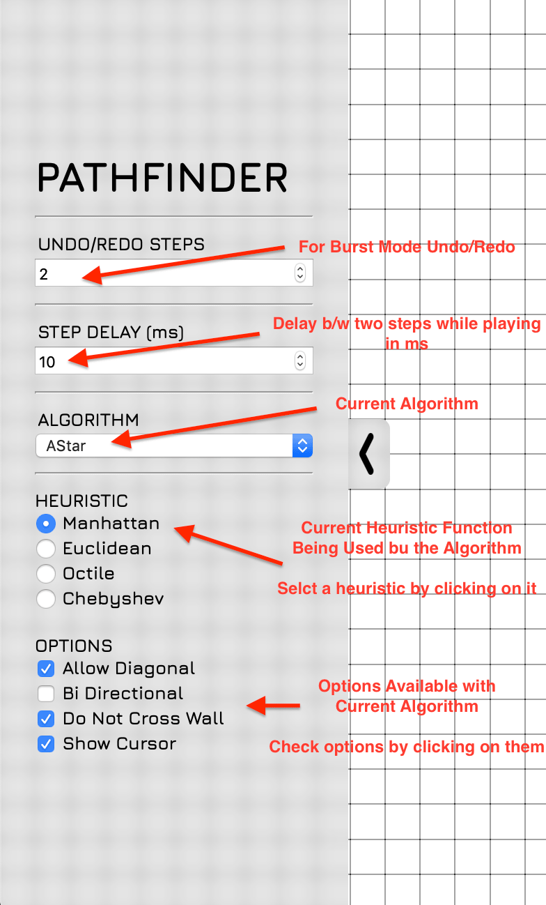
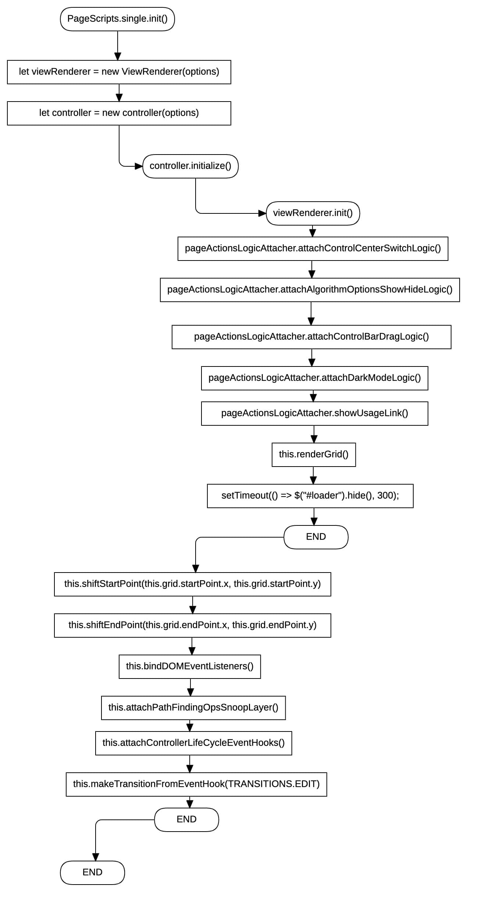
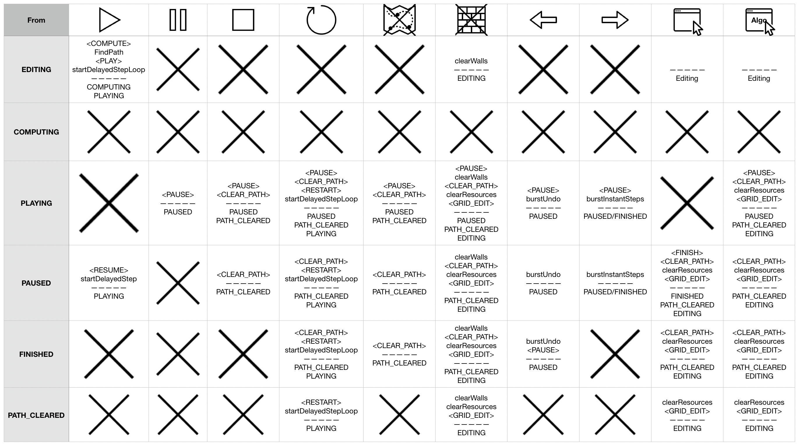

# PathFinder
Microsoft MentorShip Project as Team StarLight
- [About](#about)
- [Usage](#usage)
  1. [Draw Wall](#draw-wall)
  2. [Erase Wall](#erase-wall)
  3. [Shift Start/End-Point](#shift-startend-point)
  4. [ControlBar](#control-bar)
  5. [ControlCenter](#control-center)
  6. [KeyBoard Shortcuts](#keyboard-shortcuts)
- [Architecture](#architecture)
  1. [Folder Structure](#folder-structure)
  2. [Main Flow](#main-flow)
  3. [Controller State Machine](#controller-state-chart)
  4. [PageScripts Class Diagram](#pagescripts-class-diagram)
  5. [PathFinding Class Diagram](#pathfinding-class-diagram)
  6. [Snoop Layer Sequence Diagram](#snoop-layer-sequence-diagram)
  7. [ControlBar Action Map](#controlbar-action-map)
- [Technical Achievements](#technical-achievements)
- [Code Quality](#code-quality)
- [Uniqueness](#uniqueness)
- [Getting Started](#getting-started)

# About
This Project is for Visualization of various PathFinding algorithms.
- Single Endpoint Algorithms' Page - [Here](https://wolverin-e.github.io/PathFinding/page/)
- Multiple Endpoint Algorithms' Page - [Here](https://wolverin-e.github.io/PathFinding/page/multi)

# Usage
1. ## Draw Wall
<p align="center">
	
</p>

2. ## Erase Wall
<p align="center">
	
</p>

3. ## Shift Start/End Point
<p align="center">
	
</p>

4. ## Control Bar
<p align="center">
	
</p>

5. ## Control Center
<p align="center">
	
</p>

6. ## KeyBoard Shortcuts
	- <kbd>SPACE</kbd> - Play/Pause/Restart
	- <kbd>⌫ BACKSPACE</kbd> - Clear Path/Walls
	- <kbd>←</kbd> - Undo
	- <kbd>→</kbd> - Redo/Step
	- <kbd>↑</kbd> - Increase Undo/Redo steps
	- <kbd>↓</kbd> - Increase Undo/Redo steps
	- <kbd>⌥</kbd>+<kbd>↑</kbd> - Increase Step Delay when Playing
	- <kbd>⌥</kbd>+<kbd>↓</kbd> - Increase Step Delay when Playing

# Architecture
1. ## Folder Structure
<p align="center">
	
</p>

2. ## Main Flow
	-  [page/index.html](https://github.com/Wolverin-e/PathFinding/blob/master/page/index.html) has
	```js
	<script>PageScripts.single.init()</script>
	```
<p align="center">
	
</p>

3. ## Controller State Chart
<p align="center">
	
</p>

4. ## PageScripts Class Diagram
<p align="center">
	
</p>

5. ## PathFinding Class Diagram
<p align="center">
	
</p>

6. ## Snoop Layer Sequence Diagram
Snoop Layer is just a bunch of getters/setters. [Here](https://github.com/Wolverin-e/PathFinding/blob/083aef70d4f1a8a7f01911a43e7f516930554363/src/PageScripts/SingleEndPoint/Controller.js#L104).
<p align="center">
	
</p>

7. ## ControlBar Action Map
<p align="center">
	
</p>

# Technical Achievements
- Learnt new graph algorithms and implemented them.
- Used StateMachine in code for controller.
- Implemented [MultiBFS](https://github.com/Wolverin-e/PathFinding/blob/master/src/PathFinding/algorithms/MultiBFS.js) accommodating multiple EndPoints.
- Learnt to use WebPack to pack a package bundle.
- Implemented undo/redo functionality using stack and deque.
- Learnt the Agent **Sense-Process-Actuate** approach
	- We are Using this Approach by
		- **SENSING** in grid using [grid.getNeighbours()](https://github.com/Wolverin-e/PathFinding/blob/083aef70d4f1a8a7f01911a43e7f516930554363/src/PathFinding/core/Grid.js#L59).
		- **PROCESSING** upon sensed data in Algorithm.
		- **ACTUATING** by finding a path and following it. (showed on grid).
- Learnt how to **tap(snoop) on an attribute assignments** to an object via getters and setters.
- Practiced Object Oriented Paradigm in JavaScript.
# Code Quality
- Readibility
	- We have used EsLint as a devDependency to follow a common coding style and maintain Redability.
	- We have used camelCase variable names almost everywhere.
- Working
	- We have used babel Transpiler and PolyFill to target maximum amount of browsers possible.
	- We have used Standard Jquery to actuate page related actions.
# Uniqueness
- New UI with no 2D-WebGL **just Jquery/HTML/CSS**.
- new [**ControlBar**](#control-bar) to deliver functionalities easily.
- Provided [**Burst-Mode Undo/Redo**](#control-bar) with dynamic amount of steps, So that user can go through the steps manually.
- Provided functionality to [**choose delay dynamically**](#control-center)(ControlCenter) to play at high/low speed and let user understand at desirable speed.
- Provided functionality to [**choose burst magnitude of undo/redo dynamically**](#control-center), So that user can go through steps at desirable burst undo/redo.
- Provided [**KeyBoard Shortcuts**](#keyboard-shortcuts) so that user can control the portal easily.
- Implemented MultiEndPoint Algorithm [**MultiBFS**](https://github.com/Wolverin-e/PathFinding/blob/master/src/PathFinding/algorithms/MultiBFS.js).

# Getting Started
1. **Clone**
	```sh
	$ git clone https://github.com/Wolverin-e/PathFinding.git
	```
2. **Install**
	```sh
	# Install dependencies snapshot from package-lock.json
	$ npm ci

	# Install dependencies from package.json
	$ npm i
	```
3. **Start DevServer**
	```sh
	# webpack dev-server will be serving at 
	# localhost:8000/PathFinding/page & localhost:8000/PathFinding/page/multi
	$ npm start
	```
4.  **Lint Test**
	```sh
	$ npm run lintTest
	```

5. **Lint**
	```sh
	$ npm run lint
	```

6. **Build**
	```sh
	$ npm run build
	```
