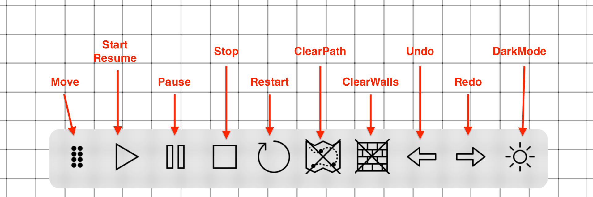
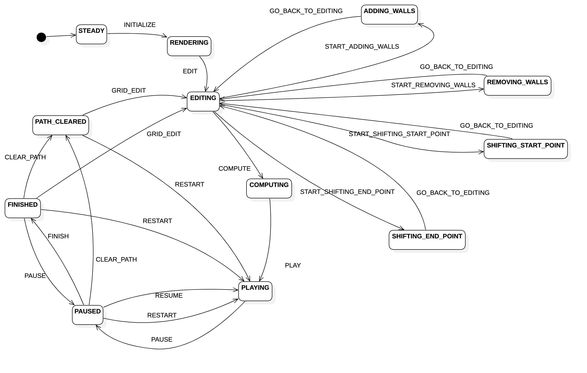
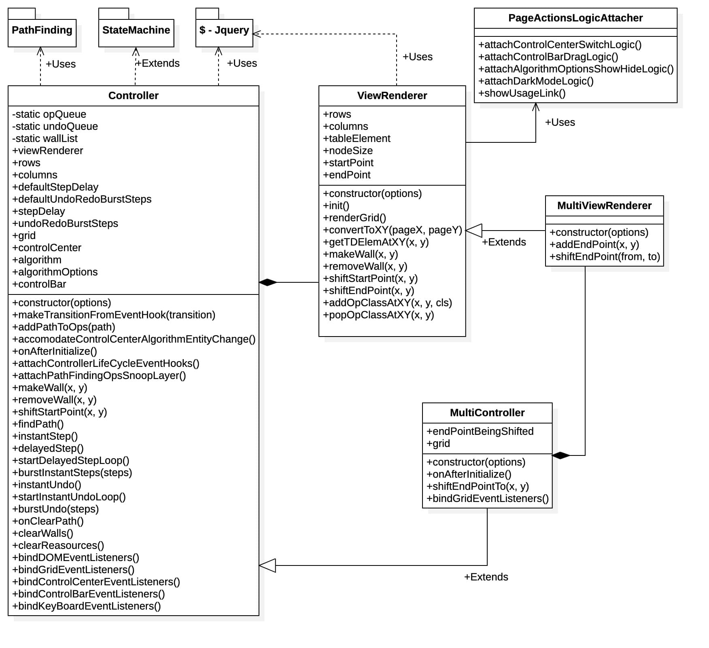

# PathFinder
Microsoft MentorShip Project as Team StarLight
- [About](#about)
- [Usage](#usage)
  1. [Draw Wall](#draw-wall)
  2. [Erase Wall](#erase-wall)
  3. [Shift Start/End-Point](#shift-startend-point)
  4. [ControlBar](#control-bar)
  5. [ControlCenter](#control-center)
  6. [KeyBoard Shortcuts](#keyboard-shortcuts)
- [Architecture](#architecture)
  1. [Folder Structure](#folder-structure)
  2. [Main Flow](#main-flow)
  3. [Controller State Machine](#controller-state-chart)
  4. [PageScripts Class Diagram](#pagescripts-class-diagram)
  5. [PathFinding Class Diagram](#pathfinding-class-diagram)
  6. [Snoop Layer Sequence Diagram](#snoop-layer-sequence-diagram)
  7. [ControlBar Action Map](#controlbar-action-map)
- [Technical Achievements](#technical-achievements)
- [Code Quality](#code-quality)
- [Uniqueness](#uniqueness)
- [Getting Started](#getting-started)

# About
This Project is for Visualization of various PathFinding algorithms.
- Single Endpoint Algorithms' Page - [Here](https://wolverin-e.github.io/PathFinding/page/)
- Multiple Endpoint Algorithms' Page - [Here](https://wolverin-e.github.io/PathFinding/page/multi)

# Usage
1. ## Draw Wall
	- Click on an empty grid node and drag the mouse pointer.
<p align="center">
	
</p>

2. ## Erase Wall
	- Click on a wall element and drag the mouse pointer.
<p align="center">
	
</p>

3. ## Shift Start/End Point
	- Click on the Start/End-point element and drag the mouse pointer.
<p align="center">
	
</p>

4. ## Control Bar
	- click on a particular action to perform it.
<p align="center">
	
</p>

5. ## Control Center
	- control center is on the left side of the screen and it can be opened by clicking on **'>'** and can be closed by clicking on **'<'**.
<p align="center">
	
</p>

6. ## KeyBoard Shortcuts
	> Keyboard shortcuts can be used for a particular ControlBar action as follows.
	>  - <kbd>SPACE</kbd> - Play/Pause/Restart
	> 	- <kbd>⌫ BACKSPACE</kbd> - Clear Path/Walls
	> 	- <kbd>←</kbd> - Undo
	> 	- <kbd>→</kbd> - Redo/Step
	> 	- <kbd>↑</kbd> - Increase Undo/Redo steps
	> 	- <kbd>↓</kbd> - Increase Undo/Redo steps
	> 	- <kbd>⌥</kbd>+<kbd>↑</kbd> - Increase Step Delay when Playing
	> 	- <kbd>⌥</kbd>+<kbd>↓</kbd> - Increase Step Delay when Playing

# Architecture
1. ## Folder Structure
	- This is the folder structure of the project.
<p align="center">
	
</p>

2. ## Main Flow
	- This is the initialisation sequence of the PageScripts.single. '.single' classification is used for single EndPoint PageScript.
	-  [page/index.html](https://github.com/Wolverin-e/PathFinding/blob/master/page/index.html) has
		```js
		<script>PageScripts.single.init()</script>
		```
<p align="center">
	
</p>

3. ## Controller State Chart
	- This is the controller state chart diagram. Different states/transitions can be triggered by Controller/ControlCenter/ControlBar actions. Either automatically or manually.
<p align="center">
	
</p>

4. ## PageScripts Class Diagram
	- This is the class diagram of the PageScripts Package/Bundle.
<p align="center">
	
</p>

5. ## PathFinding Class Diagram
	- This is the class diagram of the PathFinding Package/Bundle.
<p align="center">
	
</p>

6. ## Snoop Layer Sequence Diagram
	- This sequence shows how the controller Taps(Snoops) on the operations performed by an algorithm on a Graph-Node.
	- Snoop Layer is just a bunch of getters/setters. [Here](https://github.com/Wolverin-e/PathFinding/blob/083aef70d4f1a8a7f01911a43e7f516930554363/src/PageScripts/SingleEndPoint/Controller.js#L104).
<p align="center">
	
</p>

7. ## ControlBar Action Map
	- This is a action map for controlbar in each controller state.
	- **'x'** in a cell shows that that action will not be available in that controller state.
	- **'<>'** around a word shows that the word is a controller state Machine transition from a state to another state.
	- under **'----'** are the states from which the controller state Machine is going to pass through
<p align="center">
	
</p>

# Technical Achievements
1. Learnt new **Graph Algorithms** and **implemented** them.
2. Implemented these **Single EndPoint** accommodating algorithms.
	1. [**BreadthFirstSearch**](https://github.com/Wolverin-e/PathFinding/blob/master/src/PathFinding/algorithms/BreadthFirstSearch.js)
	2. [**AStar**](https://github.com/Wolverin-e/PathFinding/blob/master/src/PathFinding/algorithms/AStar.js)
	3. [**BestFirstSearch**](https://github.com/Wolverin-e/PathFinding/blob/master/src/PathFinding/algorithms/BestFirstSearch.js)
	4. [**Dijkshtra**](https://github.com/Wolverin-e/PathFinding/blob/master/src/PathFinding/algorithms/Dijkshtra.js)
	5. [**IDAStar**](https://github.com/Wolverin-e/PathFinding/blob/master/src/PathFinding/algorithms/IDAStar.js)
	6. [**IDDFS**](https://github.com/Wolverin-e/PathFinding/blob/master/src/PathFinding/algorithms/IDDFS.js)
	7. [**JumpPointSearch**](https://github.com/Wolverin-e/PathFinding/blob/master/src/PathFinding/algorithms/JumpPointSearch.js)
3. Implemented these **Multiple EndPoints** accommodating algorithms.
	1. [**MultiBFS**](https://github.com/Wolverin-e/PathFinding/blob/master/src/PathFinding/algorithms/MultiBFS.js).
	2. [**MultiBestFirstSearch**](https://github.com/Wolverin-e/PathFinding/blob/master/src/PathFinding/algorithms/MultiBestFirstSearch.js)
	3. [**MultiAStar**](https://github.com/Wolverin-e/PathFinding/blob/master/src/PathFinding/algorithms/MultiAStar.js)
	4. [**MultiDijkshtra**](https://github.com/Wolverin-e/PathFinding/blob/master/src/PathFinding/algorithms/MultiDijkshtra.js)
4. Learnt how to use **StateMachine** in code for controller.
5. Learnt to use **WebPack** to pack a package bundle.
6. Implemented **undo/redo functionality using stack and deque**.
7. Learnt the Agent **Sense-Process-Actuate** approach
	- We are Using this Approach by
		- **SENSING** in grid using [grid.getNeighbours()](https://github.com/Wolverin-e/PathFinding/blob/083aef70d4f1a8a7f01911a43e7f516930554363/src/PathFinding/core/Grid.js#L59).
		- **PROCESSING** upon sensed data in Algorithm.
		- **ACTUATING** by finding a path and following it. (showed on grid).
8. Learnt how to **Tap(Snoop) on an attribute assignments** to an object via getters and setters.
9. Practiced **Object Oriented Paradigm in JavaScript**.
# Code Quality
1. Readability
	- We have used **EsLint** as a devDependency to follow a **common coding style** and maintain Redability.
	- We have used **camelCase variable names** almost everywhere except some global constants.
2. Working
	- We have used **babel Transpiler and PolyFill to target maximum amount of browsers** possible.
	- We have used **Standard Jquery** to actuate page related actions.
# Uniqueness
1. New UI with no 2D-WebGL **just Jquery/HTML/CSS**.
2. new [**ControlBar**](#control-bar) to deliver functionalities easily.
3. Provided [**Burst-Mode Undo/Redo**](#control-bar) with dynamic amount of steps, So that user can go through the steps manually.
4. Provided functionality to [**choose delay dynamically**](#control-center)(ControlCenter) to play at high/low speed and let user understand at desirable speed.
5. Provided functionality to [**choose burst magnitude of undo/redo dynamically**](#control-center), So that user can go through steps at desirable burst undo/redo.
6. Provided [**KeyBoard Shortcuts**](#keyboard-shortcuts) so that user can control the portal easily.
7. Implemented These MultiEndPoint Algorithms.
	1. [**MultiBFS**](https://github.com/Wolverin-e/PathFinding/blob/master/src/PathFinding/algorithms/MultiBFS.js).
	2. [**MultiBestFirstSearch**](https://github.com/Wolverin-e/PathFinding/blob/master/src/PathFinding/algorithms/MultiBestFirstSearch.js)
	3. [**MultiAStar**](https://github.com/Wolverin-e/PathFinding/blob/master/src/PathFinding/algorithms/MultiAStar.js)
	4. [**MultiDijkshtra**](https://github.com/Wolverin-e/PathFinding/blob/master/src/PathFinding/algorithms/MultiDijkshtra.js)

# Getting Started
- **Clone**
	```sh
	$ git clone https://github.com/Wolverin-e/PathFinding.git
	```
- **Install**
	```sh
	# Install dependencies snapshot from package-lock.json
	$ npm ci

	# Install dependencies from package.json
	$ npm i
	```
- **Start DevServer**
	- Read [This](https://github.com/Wolverin-e/PathFinding/blob/master/webpack.config.babel.js) for more info.
	```sh
	# webpack dev-server will be serving at 
	# localhost:8000/PathFinding/page & localhost:8000/PathFinding/page/multi
	$ npm start
	```
- **Lint Test**
	```sh
	$ npm run lintTest
	```

- **Lint**
	```sh
	$ npm run lint
	```

- **Build**
	- Read [This](https://github.com/Wolverin-e/PathFinding/blob/master/webpack.config.babel.js) for more info.
	```sh
	# This generates latest bundles using webpack in PathFinding/build directory
	$ npm run build
	```
